## Training
### DreamBooth with LoRA
This has trained the model with default settings, including 512x512 resolution, 8GB GPU memory occupied, 1 image per batch, a learning rate of 1e-4, and the training step is set to the value obtained by multiplying the number of training images by 200.

First, Initialize [🤗Accelerate](https://huggingface.co/docs/accelerate/index) environment with:
 ```
  accelerate config
 ```
 It is developed by Hugging Face.

 Then, Run the training script. 

 ```bash
accelerate launch train_dreambooth_lora.py \
--pretrained_model_name_or_path="runwayml/stable-diffusion-v1-5" \
--instance_data_dir="images/jjangu" \
--instance_prompt="A wkdrn jjangu" \
--validation_prompt="A wkdrn jjangu standing" \
--resolution=512 \
--train_batch_size=1 \
--gradient_accumulation_steps=1 \
--learning_rate=1e-4 \
--lr_scheduler="constant" \
--lr_warmup_steps=0 \
--max_train_steps=400 \
--validation_epochs=50 \
--seed="0" \
--push_to_hub
```
### Inpaint Anything
This model can create a background for character images. After generating a character-shaped image using the "train_dreambooth_lora" model, you can input the image into the "Inpaint Anything" model. Choose the "Replace Anything" task in "Inpaint Anything."

First, installation Requires 
 ```
  py python>=3.8
 ```
Second, Download the model checkpoints provided in "Segment Anything"
(e.g. sam_vit_h_4b88939.pth) and put them into ```./pretrained_models ```

Finally, Run the training script. 
```bash
python replace_anything.py \
    --input_img images/zzangu_0.png \
    --coords_type key_in \
    --point_coords 750 500 \
    --point_labels 1 \
    --text_prompt "The object is standing right in front of background where fireworks are being displayed" \
    --output_dir ./results \
    --sam_model_type "vit_h" \
    --sam_ckpt ./pretrained_models/sam_vit_h_4b8939.pth
```


## Inference
You can find more detailed information [DreamBooth fine-tuning with LoRA](https://huggingface.co/docs/peft/task_guides/dreambooth_lora)

```python
from huggingface_hub.repocard import RepoCard

lora_model_id = "ssarae/dreambooth_kuromi"
card = RepoCard.load(lora_model_id)
base_model_id = card.data.to_dict()["base_model"]

pipe = StableDiffusionPipeline.from_pretrained(base_model_id, torch_dtype=torch.float16).to("cuda")
pipe.load_lora_weights(lora_model_id)
image = pipe("a photo of znfhal kuromi", num_inference_steps=20).images[0]

image.save('Kuromi.png")
```
## Result
| DreamBooth                               | Inpaint Anything                                                                        | DreamBooth                              | Inpaint Anything                                                                           |
| ---------------------------------------- | --------------------------------------------------------------------------------------- | --------------------------------------- | ------------------------------------------------------------------------------------------ |
| 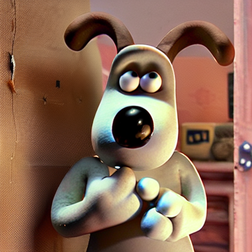| <p align="center">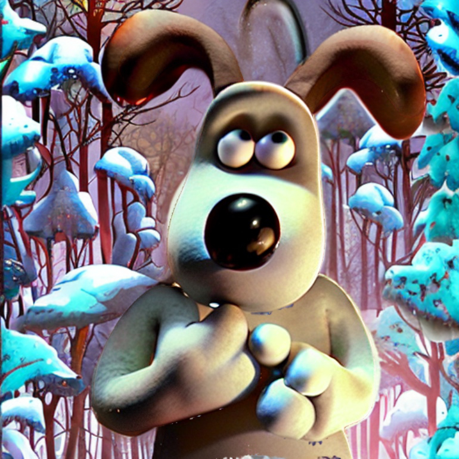</p> | 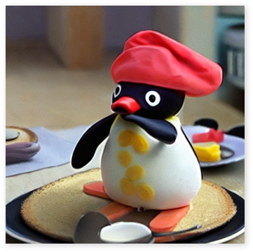 | <p align="center">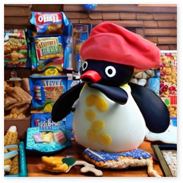</p>     |
| A rmfhalt gromit frowning                | The object is standing in a moonlit forest, a cartoon-style background                  | A vldrn pingu wearing a Chef Outfit     | The object is standing in front of a house made of snacks. It's like a fairy tale and cute |
| 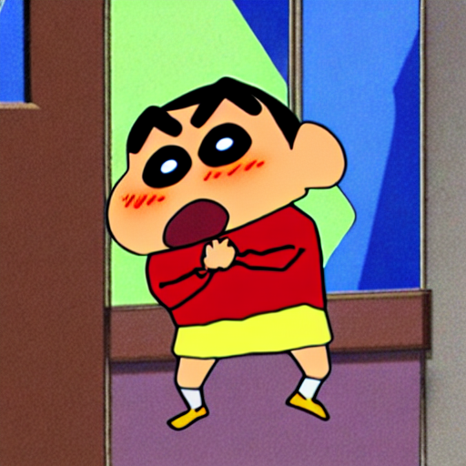 | <p align="center">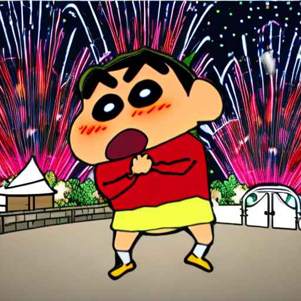</p> | 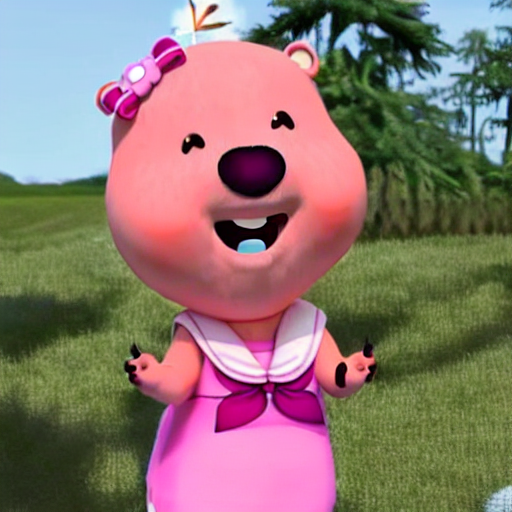 | <p align="center">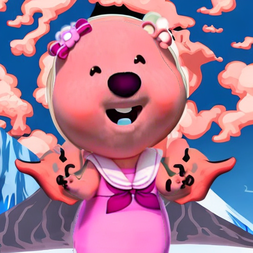</p>     |
| A wkdrn jjangu standing                  | The object is standing right in front of background where fireworks are being displayed | A fnvl loopy smiling                    | It’s a volcanic eruption in the background around the object, a cartoon-style background   |   
| 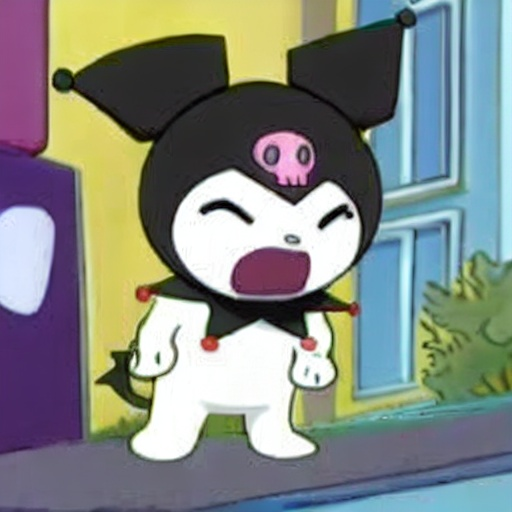 | <p align="center">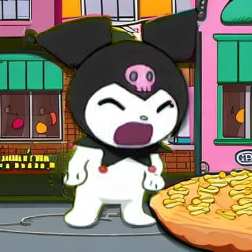</p> | 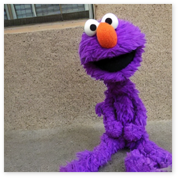  | <p align="center">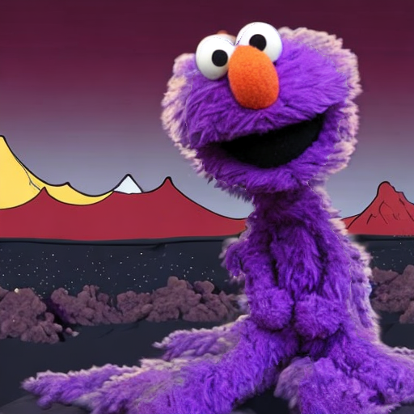</p>      |
| A znfhal kuromi screaming                | The object is standing in front of a house made of snacks, a cartoon-style background   | A purple dpfah elmo                     | It’s a volcanic eruption in the background around the object, a cartoon-style background   |


## Demo
You can watch the demo video using [Gradio](https://github.com/gradio-app/gradio). </br>
This is a video that creates `Elmo` among the six characters. </br>

https://github.com/binnnnnny/character_meme_generator/assets/118752772/d7d08a8d-8376-49e0-a2c6-686ffd410c99

